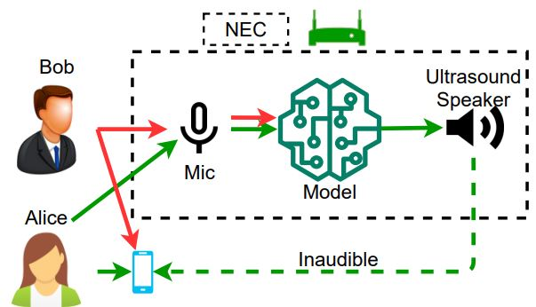
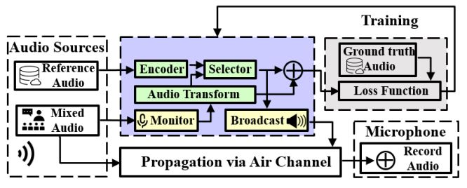
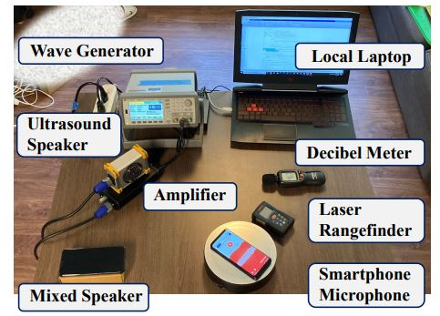
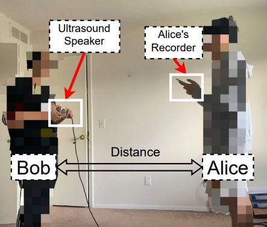

### **Motivation**:
- **Necessity of Recorder Jammer:** Voice recording is an essential information-sharing approach, which is benefiting many aspects of our daily life. Nowadays, smartphones and Internet-of-Things (IoT) devices equipped with microphones allow people to record voice anytime and anywhere.
However, the growing presence of unauthorized microphones has led to numerous incidences of privacy violations. Off-the-shelf microphones are widely available and can be deployed to steal users' biometric traits (e.g. voiceprints) or private conversations. Thus, unauthorized voice recording has become a serious societal issue.

- **Limitation of Existing Jammer:** Existing jammers disrupt unauthorized voice recording by emiting an ultrasounic scrambling noise. However, there are two limitations of those applications/devices.
    1. It will **affact** the normal usage of other voice users. For example, in the cover figure, when Bob deploys such jammer in public, all the microphones will be jammed, which means the surrounded people cannnot use their voice assistants, video call, and enmergency call meanwhile.
    2. It's **not secure enough**. The jammed recording can be parsed if the attacker know the noise pattern. If the attacker learns the frequency pattern of the scrambling noise wave, the attacker can deploy an additional microphone to nullify the noises and record them illegally

- **Speaker specified feature**: We found every speaker has a distinct speech feature that introduced by the variety of their vocal system. By adopting the speaker specified feature, we can extract Bob's voice from a mixed audio input. Then we use a ultrasound speaker to play the rest sound (e.g., Alice's voice) that not belong to Bob, and overshadow Bob's voice in the wild while maintaining the other speakers' voice on their end.

### **Methodology**
  
The core of our model is the speaker **Selector** that present in above figure. We use the **Selector** to extract Bob's voice in real-time. To train the **Selector**, we construct many mixed audio from two speakers, and introduce the prior knowledge (**Reference Audio**) of the one speaker in the **mixed audio**. Through filtering out the known speaker from the mixed audio, the **Selector** learns to extract speaker specified voice from the mixed sound. Then, the **Selector** produces the filtered **Bob's irrelated** to mix the original sound, and hence hide **Bob's voice** on the recorder side.

### **Demo**
Setup-1           |  Setup-2
:---------------:|:---------------:
  |  

There are two experimental settings of our work. **Left** is the benchmark test running with public dataset and simulate the mixed speaker plays the mixed audio. **Right** is the real world scenario that Bob holds our device to protect his voice without intervening Alice's phone use.

*Below are the voice demos of our system that recorded from **Alice's recorder**.*

<table>
<tr>
	<td>Bob and Alice talk simultaneously</td>
	<td>Only Alice's voice is kept</td>
</tr>
<tr>
	<td><audio controls>
		  <source src="joint.wav" type="audio/wav">
		  Your browser does not support the <code>audio</code> element.
		</audio></td>
	<td><audio controls>
		  <source src="joint-focus.wav" type="audio/wav">
		  Your browser does not support the <code>audio</code> element.
		</audio></td>
</tr>
<tr>
	<td><audio controls>
		  <source src="conversation.wav" type="audio/wav">
		  Your browser does not support the <code>audio</code> element.
		</audio></td>
	<td><audio controls>
		  <source src="conversation-hide.wav" type="audio/wav">
		  Your browser does not support the <code>audio</code> element.
		</audio></td>
</tr>
</table>

