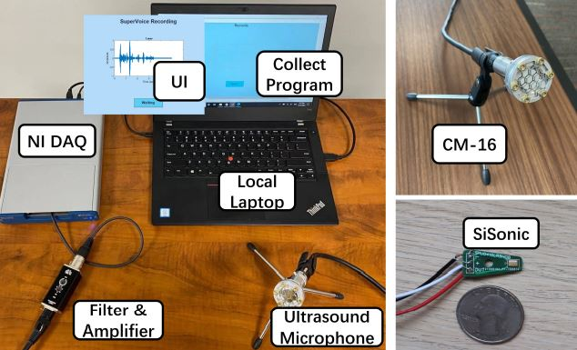
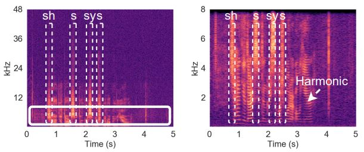
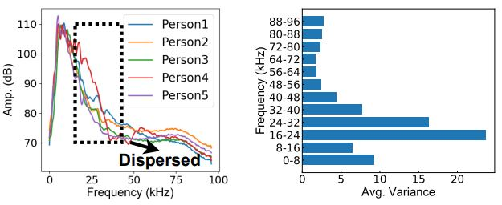
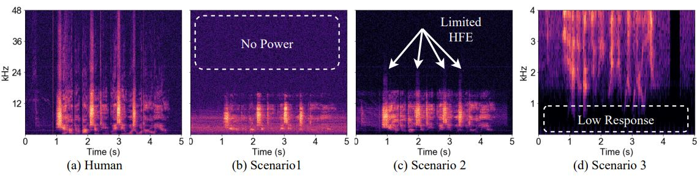
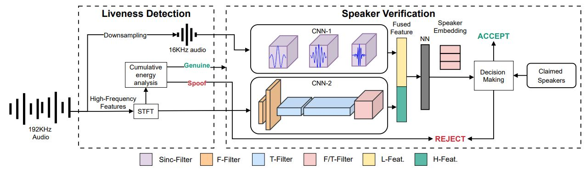

### **Motivation**:

- **Ultrasound in Speech**: We found that human can produce ultrasound by collecting human speech with a high-end ultrasonic microphone ([CM-16](http://www.avisoft.com/ultrasound-microphones/cm16-cmpa/)). See the experimental setup below:
 From the recorded human speech, we analyze the spectrogram and present it to the next figure.

It shows that when participants say "*She had your dark suit in greasy wash water all year*", there are some phonemes such as **/sh/**, **/s/**, **/sy/**, **/s/** reach extremely high frequencies (e.g., ~40kHz). The reason why human can produce some ultrasound is the different manners of articulation make different airstream flows. When two speech organs narrow the airstream to cause friction to occur as it passes through, Fricatives are produced. If the airstream is stopped and then released, Stop or Affricate is produced. We found that **fricative**, **stop**, and **affricate** phonemes often carries more energy in ultrasound band.

- **Distinctiveness of Ultrasound**: We extract the speech energies at **fricative**, **stop**, and **affricate** phonemes and summerize them together to represent the identity of the speakers by using $$S_{LTA}(f)=\frac{1}{M}\sum_{t=1}^{N} S(f, p)$$
where `S(f,p)` represents the spectrogram value at frequency `f` and time frame `p`. By comparing the $$S_{LTA}(f)$$ of different participants, we get the following results.

From the left figure, we can see that participants have dispersed speech energies between frequency range from `20kHz-40kHz`, for lower frequencies, we observed similar speech energy trends. The right figure shows the average variance of those speakers, it is evident to show that `16-24kHz`, `24-32kHz` and `32-40kHz` contribute more differences to differentiate participants.

- **Ultrasound Speech for Liveness Detection** Since we find that human can produce some ultrasound, we then use them to detect whether a sound is generated by human or a speaker.
 Through recording the human speech and the replay sound, we present the spectrogram differences as follow: 
   + Human: Human speech directly recorded by an ultrasound microphone.
   + Scenario1: Attackers record and replay with commercial devices (smart phones).
   + Scenario2: Attackers record with high-end microphones and replay with commercial speakers (smart phones).
   + Scenario3: Attackers record with high-end microphones and replay with ultrasound speakers.

We can observe the apparent difference for four spectrograms. By exploiting this clear differences, we can design our liveness detection algorithm to reach high detection accuracy.

### **Methodology**

We design a end to end speaker authentication system, which includes a liveness detection module and a speaker verification module. By incorporating the ultrasound component in human speech, we design a <em>**Cumulative energy analysis**</em> method to detect replay attack. Furthermore, we introduce a <em>**two-stream DNN**</em> to handle the low frequency data and the high frequency speech, and fused the extracted feature together to verify the user's voice.

### **Demo**
For more descripitions and **demos** of our collected high frequency human speech, please visit [**Here**](https://supervoiceapp.github.io).
