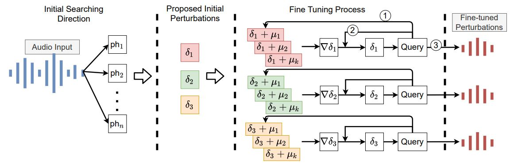

### **Motivation**:

- **Query-Inefficient**: Existing black box audio attacks require plenty of queries to interact with the victim speech models, e.g., [Devil's whisper](https://www.usenix.org/system/files/sec20summer_chen-yuxuan_prepub.pdf) attacks commercial speech to text model by training an substitute model through querying victim model. [OCCAM](https://arxiv.org/pdf/2110.09714.pdf) estimates the gradient by incorporating evolutionary algorithms. The extensive query is time consuming, costly and may attract attention.

- **Decision-Boundary**: We find that the decision boundary in speech to text model is different from it in computer vision models. Due to the non-contiguous decision boundary, it's hard for attacker to initialize the perturbation.

- **Phoneme** We find a short phoneme can surprisingly alter the speech model prediction. Based on the observation, we decide to optimize the duration and power of phoneme to inject it attacking the speech to text model.

### **Methodology**
 There are three stages to generate a perturbation. At stage 1, given an input audio, we inject many different phonemes to it and try to alter the transcript result. Next, we collect the phonemes or phoneme combinations to a perturbation set. At stage 3, we estimate the gradient by applying small changes to the candidate perturbation, and then estimate the gradient direction through observing the prediction result changes. Then apply the estimated gradient to fine tuning the perturbation. Finally, we can get the adversarial perturbation targeting to a input audio.

<!-- ### **Demo**

<table>
<tr>
	<td>Bob and Alice talk simultaneously</td>
	<td>Only Alice's voice is kept</td>
</tr>
<tr>
	<td><audio controls>
		  <source src="./assets/joint.wav" type="audio/wav">
		  Your browser does not support the <code>audio</code> element.
		</audio></td>
	<td><audio controls>
		  <source src="./assets/joint-focus.wav" type="audio/wav">
		  Your browser does not support the <code>audio</code> element.
		</audio></td>
</tr>
</table>

 -->
