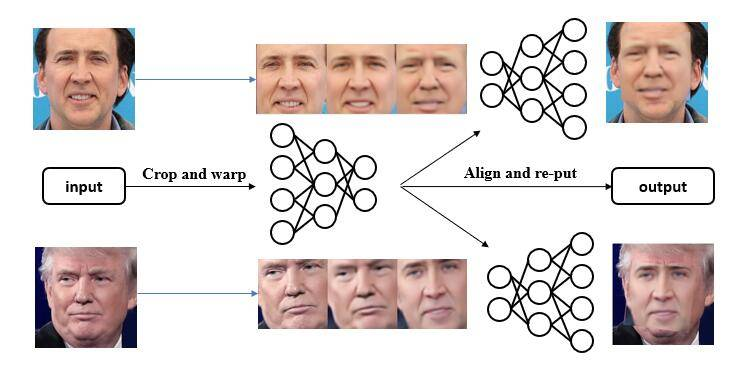

<h2>What is Deepfakes</h2>
Basically, Deepfakes is an unsupervised machine learning algorithm. 
It trains <code>one encoder</code> and <code>two decoders</code> to process <code>person A</code> and <code>person B</code>, the loss can be calculated by difference between ground truth image and decoded image. 
For example, it trains an <code>encoder(e)</code> to extract person A features, and trains a <code>decoder(dA)</code> to decode A's feature and produce fake A's <code>image(fA)</code>. Through comparing difference between <code>original image</code> and <code>fA</code>, to make encoder and decoder work well.  
Similarly, the same <code>encoder(e)</code> also extracts B's feature,
and trains a <code>decoder(dB)</code> to decode B's feature and produce fake B's <code>image(fB)</code>. 

Think about it, what if given a image of A, and use <code>(dB)</code> to decode, what will happens?
 

Here is the magic:

<h2>Basic Concept</h2>
This basic concept of deepfake can also be found here: <a href="https://www.alanzucconi.com/2018/03/14/understanding-the-technology-behind-deepfakes/">understanding Deepfakes </a>
or chinese version <a href="https://oldpan.me/archives/deepfake-autoencoder-face-swap"> Good Tutorial of Chinese version Deepfakes</a>
In my tutorial, I give a solution to use pytorch implement deepfakes and change trump's presentation video with my face!

<h2>5 Steps To Use My code</h2>
find my code at <a href="https://github.com/hanqingguo/deepfake-pytorch">My Code</a> and git clone to an empty repo.

<h3>Requirement:</h3>
<pre>
python == 3.6
pytorch &gt= 0.4.0 or 1.0
dlib
</pre>

<h3>1. Construct Dataset</h3>

 First of all, we need to constrcut our dataset. 

<pre>
$ cd #current directory#
$ mkdir train
$ cd train
</pre>

Put videos of A and B to train/ , for example, trump.mp4 and me.mp4 where A is trump, B is myself 

<h3>2. Crop frames from videos</h3>
In train/ directory, make two subdirectory to store all frames of videos
<pre>
$ mkdir personA
$ mkdir personB
</pre>
Run <pre>python crop_from_video.py</pre> to save frames to <code>personA</code> and <code>personB</code> directory.  

Make sure change <code>Video_Path</code> and <code>save_path</code> parameter in the python file. Do it twice to crop trump video to <code>personA</code> directory, crop my video to <code>personB</code> directory.

<h3>3. Collect faces from frames</h3>
In train/ directory, make two subdirectory to store faces of all frames.
<pre>
$ mkdir personA_face
</pre>
#(To save faces of person A from personA)
<pre>
$ mkdir personB_face
</pre>
 #(To save faces of person A from personA) 

Run <pre>python crop_face.py</pre> use <code>dlib</code> to crop faces from frames and save to <code>personA_face</code> and <code>personB_face</code> 

## Make sure change Image_Folder and OutFace_Folder parameter in the python file. Do it twice to crop trump face to <code>personA_face</code> directory, crop myselft face to personB_face directory.

<h3>4. Train Model</h3>
<pre>python train.py</pre>
<h3>5. Load Model and Output video with my face and trump body</h3>
<pre>python convert_video.py</pre>

<h3>Interesting!</h3>
<video width="400" controls>
<source src="me4_out.mp4" type="video/mp4">
</video>
 
