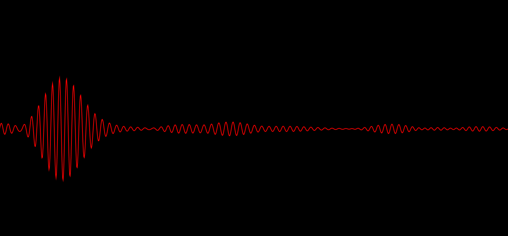
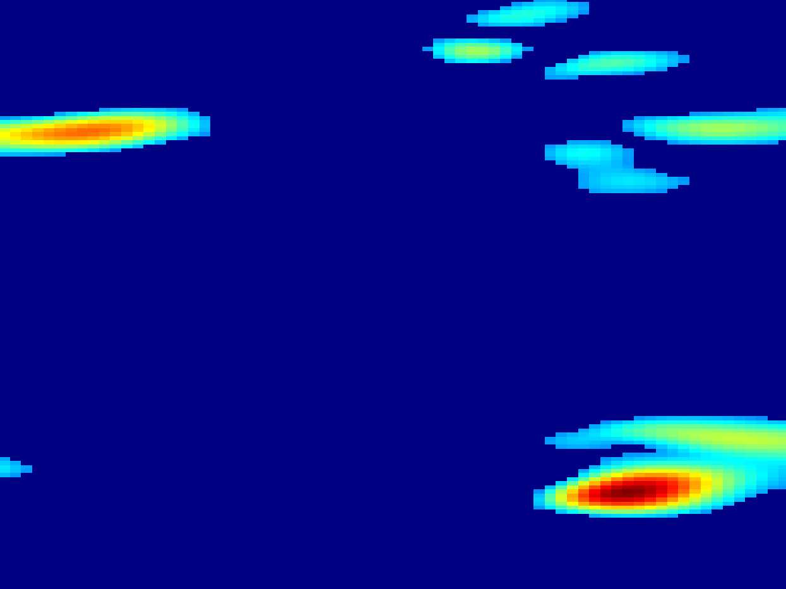
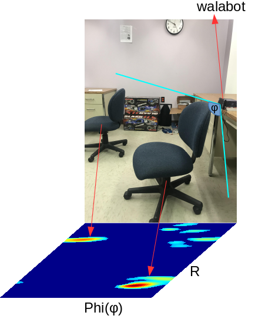
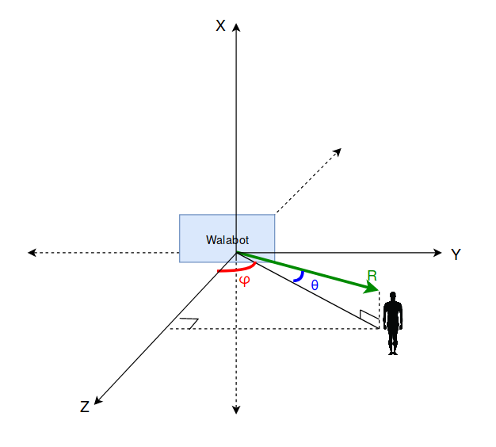
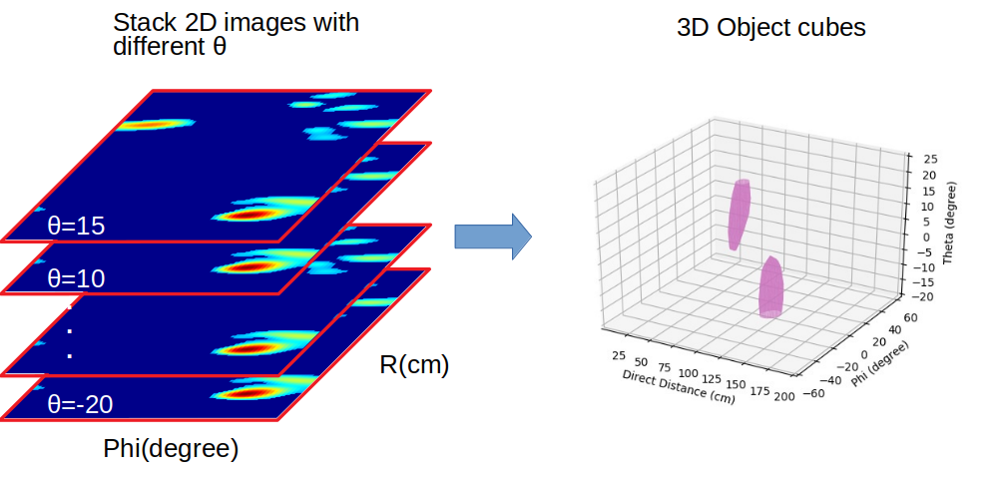
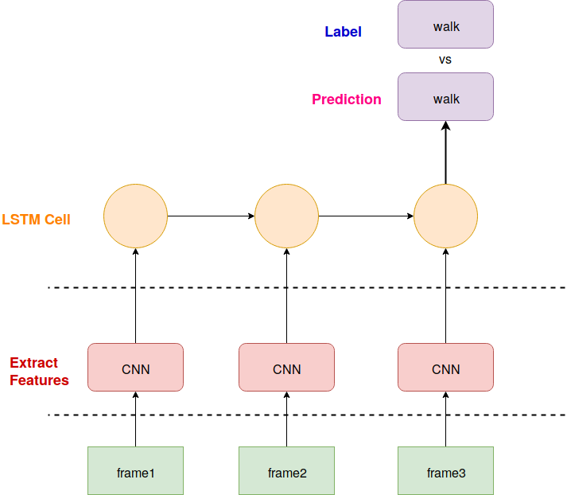

<a href="https://walabot.com/">Walabot</a> senses environment by transmitting, receiving and recording signals from MIMO antennas. The frequency range from 3.3-10 GHz.
Today I am going to show you how walabot collect 3D images.

<h2>Raw signals</h2>
  
   
  

  Our radar sensing platform emits probing pulse signals x(t) at a pulse repetition frequency (PRF) of 16 Hz, but within each pulse repetition interval (PRI), the receiver antenna
samples the received signal y(t) at a very high frequency of 8 KHz.
  The x-axis of raw signals is response time, while y-axis means amplitude at that time slot. Red line is actually samples what receiver antenna sampling.
  In other words, response time is signal traverse time from transmit antenna to receive antenna, which depends on distance to radar. Higher amplitude at specific time, means there is object at that place.
  

<h2>2D images</h2>

  

    
  

  

    
  

  
While 2D images only shows &phi; (wide angle) versus <var>R</var>;. However, any object in real world is 3D, it has height as well, then introduce &theta; (elevation angle) as height.
  To get 3D image, let's see the axis system in walabot.

     
    where  
    <code>
      X = R*Sin&theta; 
      Y = R*Cos&theta;Sin&phi; 
      Z = R*Cos&theta;Cos&phi;
    </code>

<h2>3D images</h2>
  
Instead of using 2D images, we construct 3D images based on those 2D images by stacking them in vertical direction.

  
  
Figure above shows how to stack 2D images, the implement process are
    <ol>
  <li>Concatenate 2D images to 3D matrix </li>
  <li>Use <code>measure.marching_cubes_classic</code> to make vertices and faces</li>
  <li>Change axis ranges from interval index to real unit 
    For example:  
    <code>
    (0,100) => (1,200)  R(cm) 
    (0,61)  => (-90,90) &phi;(degree) 
    (0,9)   => (-20,20) &theta;(degree)
    </code>
  </li>
  <li>Use <code>Poly3DCollection</code> to get mesh</li>
</ol>
  

<h2>3D videos</h2>
  
Once get 3D image, we save it to IO buffer, and use PIL to open buffer, then convert it to ndarray, write ndarray as one frame to video by using openCV

  <video width="400" controls>
  <source src="walk.mp4" type="video/mp4">
  </video>
  
Video above shows a human walk around walabot radar.

<h2>CNN extract Features</h2>

For each frame, we use resnet-18 to extract features, we change last Average pooling to Max pooling because Max pooling extracts the most important features like edges whereas,
  average pooling extracts features so smoothly. For image data, you can see the difference. Although both are used for same reason, I think max pooling is better for extracting the extreme features.
  Average pooling sometimes can’t extract good features because it takes all into count and results an average value which may/may not be important for object detection type tasks.
  Then change output linear layer to extract 10 features.

<h2>LSTM training</h2>
  
 
     
    We use 3 frames to recognize one activity. Since 3D radar signal shown above is abstract video. Unlike camera videos which each frame represent a activity, radar video can only be detected by
    continuous frames change to recognize one activity. We collect many 3 frames video for each activity as training data. When testing, given continuous stream radar video, and feed every 3 frames to
    LSTM network, then gives our prediction for each frame.
    Detailed technique will be present in my next paper.

  

